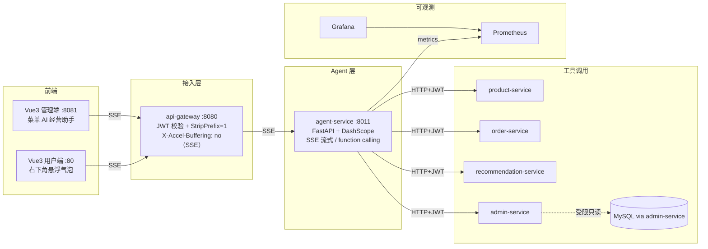
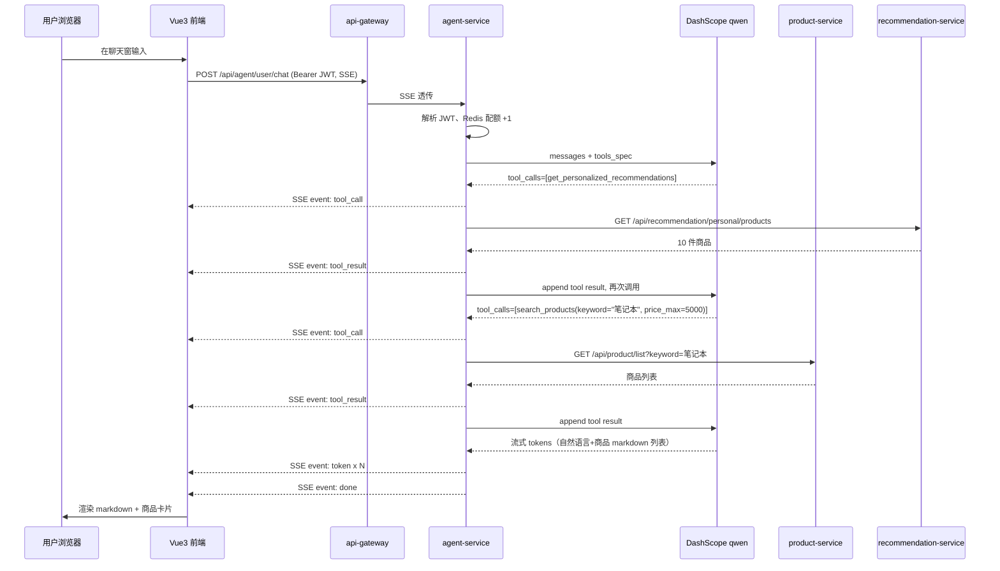
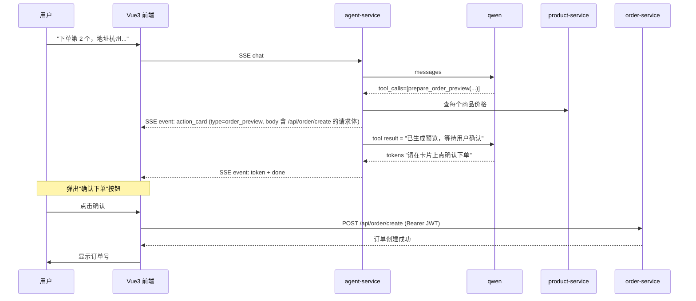

# AI Agent 双端架构设计

> 创建日期：2026-04-25
> 适用版本：本仓库 master 分支（agent-service 1.0.0）

本文档描述本项目新增的 `agent-service` 微服务，以及它如何为「用户购物」与「管理经营分析」两端提供基于通义千问的对话式 AI 能力。

---

## 一、设计目标

| # | 目标 | 落地策略 |
|---|------|---------|
| 1 | 用对话式交互替代复杂菜单：用户可以用自然语言找商品、加购、下单 | 用户 Agent + Function Calling 调用现有商品/订单/推荐服务 |
| 2 | 让运营人员用自然语言查业务数据（销售/订单/曝光/取消率），不用每次找开发写 SQL | 管理 Agent + 5 个固定聚合工具 + 受限只读 SQL 工具 |
| 3 | 决不让 AI 「自动下单」造成意外消费 | 工具集只暴露 `prepare_order_preview`，最终确认必须由用户在前端按按钮触发 |
| 4 | 防止 AI 触达写操作 / 越权数据 | sql_guard 三重防御 + admin-service 服务端二次正则拦截 + 表白名单 |
| 5 | 防止 token 失控烧钱 | Redis 每用户每日配额 + Prometheus token 速率告警 |
| 6 | 接入既有可观测性体系 | 暴露 Prometheus metrics + 4 条专属告警 + Grafana 概览面板 |

---

## 二、整体拓扑



**关键边界**：

- AS（agent-service）从不直连 MySQL，所有数据访问都走下游服务的 HTTP 接口 → 复用现有鉴权、缓存、限流、指标
- 受限 SQL 工具走 `admin-service /api/admin/analytics/sql`，admin-service 本身也做正则黑名单防御（双重保险）
- SSE 全链路禁用了 nginx / gateway 缓冲（`proxy_buffering off; X-Accel-Buffering: no`）

---

## 三、模块清单

### 3.1 新建独立服务 `agent-service`

| 文件 | 作用 |
|---|---|
| [agent-service/Dockerfile](../agent-service/Dockerfile) | python:3.11-slim 基础镜像 + uvicorn 入口 |
| [agent-service/requirements.txt](../agent-service/requirements.txt) | fastapi/dashscope/httpx/pyjwt/redis/sqlparse/prometheus-client/pymysql |
| [agent-service/app/main.py](../agent-service/app/main.py) | FastAPI 入口，两个 SSE 端点 + health/metrics/greeting |
| [agent-service/app/config.py](../agent-service/app/config.py) | 集中配置（环境变量、下游 URL、限额） |
| [agent-service/app/llm.py](../agent-service/app/llm.py) | DashScope 流式 + function calling 主循环（约 130 行） |
| [agent-service/app/tools_user.py](../agent-service/app/tools_user.py) | 用户侧 8 个工具 + schema + dispatcher |
| [agent-service/app/tools_admin.py](../agent-service/app/tools_admin.py) | 管理侧 8 个工具 + chart 事件 emission |
| [agent-service/app/sql_guard.py](../agent-service/app/sql_guard.py) | 受限只读 SQL 校验（白名单 + 正则 + sqlparse） |
| [agent-service/app/prompts.py](../agent-service/app/prompts.py) | 两套 system prompt（用户/管理） |
| [agent-service/app/sse.py](../agent-service/app/sse.py) | SSE 编码 + 线程安全事件队列 |
| [agent-service/app/auth.py](../agent-service/app/auth.py) | JWT 解析 + Redis 配额计数 |
| [agent-service/app/metrics.py](../agent-service/app/metrics.py) | Prometheus 指标定义 |
| [agent-service/app/http_client.py](../agent-service/app/http_client.py) | 下游 HTTP 调用封装（重试/超时/JWT 透传） |

### 3.2 admin-service 新增聚合接口

| 文件 | 作用 |
|---|---|
| [admin-service/.../mapper/AnalyticsMapper.java](../admin-service/src/main/java/com/ecommerce/admin/mapper/AnalyticsMapper.java) | 7 个聚合 SQL（@Select） |
| [admin-service/.../service/AnalyticsService.java](../admin-service/src/main/java/com/ecommerce/admin/service/AnalyticsService.java) | 接口 |
| [admin-service/.../service/impl/AnalyticsServiceImpl.java](../admin-service/src/main/java/com/ecommerce/admin/service/impl/AnalyticsServiceImpl.java) | 实现 + clamp 参数 |
| [admin-service/.../controller/AnalyticsController.java](../admin-service/src/main/java/com/ecommerce/admin/controller/AnalyticsController.java) | 6 个 GET + 1 个 POST 只读 SQL（自带正则二次防御） |

### 3.3 前端

| 端 | 文件 | 作用 |
|---|------|------|
| 用户 | [frontend/src/api/agent.js](../frontend/src/api/agent.js) | SSE fetch + 帧解析 |
| 用户 | [frontend/src/components/AgentChat.vue](../frontend/src/components/AgentChat.vue) | 悬浮气泡 + 抽屉式聊天窗 + ActionCard 渲染 |
| 用户 | [frontend/src/components/Layout.vue](../frontend/src/components/Layout.vue) | 注入 AgentChat（仅登录后显示） |
| 用户 | [frontend/nginx.conf](../frontend/nginx.conf) | `/api/agent/` 禁缓冲 |
| 管理 | [admin-frontend/src/api/agent.js](../admin-frontend/src/api/agent.js) | SSE 客户端 |
| 管理 | [admin-frontend/src/views/AIInsights.vue](../admin-frontend/src/views/AIInsights.vue) | 全屏聊天分析页（含 mermaid 渲染） |
| 管理 | [admin-frontend/src/router/index.js](../admin-frontend/src/router/index.js) | `/admin/ai-insights` 路由 |
| 管理 | [admin-frontend/src/components/AdminLayout.vue](../admin-frontend/src/components/AdminLayout.vue) | 菜单项 |
| 管理 | [admin-frontend/nginx.conf](../admin-frontend/nginx.conf) | `/api/agent/` 禁缓冲 |

### 3.4 网关 + 编排

| 文件 | 改动 |
|---|---|
| [api-gateway/.../JwtAuthenticationFilter.java](../api-gateway/src/main/java/com/ecommerce/gateway/config/JwtAuthenticationFilter.java) | EXCLUDED_PATHS 加 `/api/agent/health`、`/api/agent/greeting`、`/api/agent/metrics` |
| [api-gateway/.../application.yaml](../api-gateway/src/main/resources/application.yaml) | 新增路由 `/api/agent/**` → agent-service:8011，filters: `StripPrefix=1` + `SetResponseHeader=X-Accel-Buffering, no` |
| [docker-compose.yml](../docker-compose.yml) | 新增 `agent-service`，依赖 mysql/redis；api-gateway 加入 depends_on |
| [.env.example](../.env.example) / [.env](../.env) | `DASHSCOPE_API_KEY` + `QWEN_MODEL` |

### 3.5 监控

| 文件 | 改动 |
|---|---|
| [infrastructure/monitoring/prometheus/prometheus.yml](../infrastructure/monitoring/prometheus/prometheus.yml) | 新增 scrape job `agent-service`，metrics_path=/agent/metrics |
| [infrastructure/monitoring/prometheus/rules/alerts.yml](../infrastructure/monitoring/prometheus/rules/alerts.yml) | 新增 `agent_alerts` group，4 条告警 |
| [infrastructure/monitoring/grafana/provisioning/dashboards/json/agent-overview.json](../infrastructure/monitoring/grafana/provisioning/dashboards/json/agent-overview.json) | 新增 AI Agent Overview 看板（9 panels） |

---

## 四、数据流：一次完整对话

以「我想买个适合学生的笔记本电脑，预算 5000 以内」为例：



下单环节：



> 关键约束：**agent-service 永远不调 `/api/order/create`，下单一定经过用户在前端的二次确认。**

---

## 五、SSE 事件协议

`text/event-stream`，每个事件 `event: TYPE\ndata: JSON\n\n`：

| TYPE | 含义 | data 字段 |
|---|---|---|
| `token` | LLM 增量 token | `{text: "..."}` |
| `tool_call` | LLM 决定调用某工具 | `{id, name, args}` |
| `tool_result` | 工具执行完毕 | `{id, name, result, ms}` |
| `action_card` | 用户端：下单预览卡片 | `{type, title, preview, submit:{method,path,body}}` |
| `chart` | 管理端：mermaid 图表 | `{title, mermaid}` |
| `error` | 任何错误 | `{message}` |
| `done` | 流结束 | `{ok: true}` |

---

## 六、安全设计

| 风险 | 防御 |
|---|---|
| 用户被诱导自动下单 | 工具集**不存在** `create_order`；只有 `prepare_order_preview`；前端必须用户点击按钮才走 `/api/order/create` |
| Prompt injection 让管理 Agent 跑写操作 SQL | sql_guard 三重防御：① sqlparse 检查 first token 必须是 SELECT、② 正则黑名单 `(insert|update|delete|drop|...)`、③ 表白名单 8 张表；admin-service 端再做一次正则二次拦截 |
| 越权调用其他用户数据 | 所有工具透传调用方 JWT；user 工具不接收 user_id 参数（始终从 JWT 解析） |
| 无限调用导致 token 烧钱 | 每用户每日配额（user 50/admin 200，可在 .env 调），Redis 计数器 25h TTL；Prometheus `AgentTokenSpendBurst` 告警速率 > 5000 tokens/s |
| 工具 RPC 失败 | 单工具 5s 超时 + 1 次重试；整个 tool loop 最多 8 步 |
| 工具内部错误暴露给用户 | 所有工具 catch 异常返回 `{ok: false, error: "..."}`，由 LLM 用自然语言告诉用户 |
| 网关 SSE 缓冲卡顿 | nginx + Spring Cloud Gateway 双层都设置 `proxy_buffering off / X-Accel-Buffering: no` |

---

## 七、可观测性

### 7.1 Prometheus 指标

| 指标 | 类型 | 标签 | 含义 |
|---|---|---|---|
| `agent_requests_total` | Counter | channel, status | Agent 请求总数 |
| `agent_request_duration_seconds` | Histogram | channel | 完整对话耗时（秒） |
| `agent_tokens_total` | Counter | channel, kind | 累计消耗的 prompt/completion token |
| `agent_tool_calls_total` | Counter | channel, tool, status | 工具调用次数 |
| `agent_tool_duration_seconds` | Histogram | tool | 单工具耗时 |
| `agent_quota_used` | Gauge | channel, principal_id | 当日已用配额 |
| `agent_quota_denied_total` | Counter | channel | 因配额耗尽被拒绝的请求数 |

### 7.2 告警规则（`agent_alerts` 组）

| 名称 | 触发条件 | 严重级别 |
|---|---|---|
| `AgentRequestErrorHigh` | error 比例 > 10% 持续 5m | warning |
| `AgentLatencyP99High` | P99 > 30s 持续 5m | warning |
| `AgentTokenSpendBurst` | token 速率 > 5000/s 持续 5m | critical |
| `AgentToolCallFailureRate` | 单工具错误率 > 20% 持续 3m | warning |

### 7.3 Grafana 看板

`AI Agent Overview`（uid: `agent-overview`），9 个面板覆盖：服务存活、请求总量、token 总量、配额拒绝、按通道分桶 RPS、P50/P95/P99 延迟、token/sec、tool call rate、tool failure rate 表格。

---

## 八、本地启动与配置

### 8.1 必填环境变量

在 `.env` 中：
```bash
DASHSCOPE_API_KEY=sk-xxx        # 必填，从 https://bailian.console.aliyun.com 申请
QWEN_MODEL=qwen-plus            # 可选，默认 qwen-plus；可改 qwen-max（更强）/ qwen-turbo（更快）
```

未配置 `DASHSCOPE_API_KEY` 时 `agent-service` 仍可正常启动，所有 SSE 端点会立即返回 `event: error\ndata: {"message":"agent-service 未配置 DASHSCOPE_API_KEY..."}`，前端会以友好提示展示。

### 8.2 启动

```bash
docker compose up -d agent-service        # 单独起
docker compose up -d                       # 全栈
```

健康检查：

```bash
curl http://localhost:8080/api/agent/health
# {"status":"healthy","model":"qwen-plus","llm_configured":true,"version":"1.0.0"}
```

### 8.3 体验入口

- 用户端：http://localhost → 登录 `qa_tester / Qa@12345` → 右下角悬浮 🤖 按钮
- 管理端：http://localhost:8081 → 登录 `admin / admin123` → 左侧菜单「AI 经营助手」

---

## 九、调用示例

### 9.1 用户 Agent

```bash
TOKEN=$(curl -s -X POST http://localhost:8080/api/user/login \
  -H 'Content-Type: application/json' \
  -d '{"username":"qa_tester","password":"Qa@12345"}' | jq -r .token)

curl -N -X POST http://localhost:8080/api/agent/user/chat \
  -H "Authorization: Bearer $TOKEN" \
  -H 'Content-Type: application/json' \
  -d '{"user_message":"给我推荐三款适合学生用的笔记本"}'
```

输出（SSE）：

```
event: tool_call
data: {"id":"call_1","name":"get_personalized_recommendations","args":{"limit":10}}

event: tool_result
data: {"id":"call_1","name":"get_personalized_recommendations","result":{...},"ms":120}

event: token
data: {"text":"根据你最近浏览的"}
event: token
data: {"text":"电子产品类目，"}
...
event: done
data: {"ok":true}
```

### 9.2 管理 Agent

```bash
ATOK=$(curl -s -X POST http://localhost:8080/api/admin/auth/login \
  -H 'Content-Type: application/json' \
  -d '{"username":"admin","password":"admin123"}' | jq -r .data.token)

curl -N -X POST http://localhost:8080/api/agent/admin/chat \
  -H "Authorization: Bearer $ATOK" \
  -H 'Content-Type: application/json' \
  -d '{"user_message":"最近 7 天哪个类目销量最高？"}'
```

LLM 会自动决定调用 `get_category_performance(days=7)`，工具内部调 admin-service 拿数据，返回 `chart` 事件（mermaid pie 图）+ token 事件（数据表 + 解读 + 建议）。

---

## 十、未来扩展

| 方向 | 思路 |
|---|---|
| 多轮对话记忆 | 当前所有上下文由前端维护并整体回传；后续可引入 Redis 会话状态 |
| 长文档检索 | 引入向量库（Milvus / pg_vector），把帮助文档、商品详情向量化，加 RAG 工具 |
| Agent 协作 | 用 ReAct / LangGraph 把 user / admin 拆成专精 Agent，加调度 Agent |
| 真人回路 | 高风险动作（比如关闭某个秒杀活动）走"提议 → 人工审批"二阶段 |
| 真正只读账号 | 给 agent-service 的 SQL 工具用专门的 `agent_ro` MySQL 账号（GRANT SELECT only） |
| 模型切换 | 把 DashScope 抽象成 OpenAI 兼容 API，便于平滑切换到 OpenAI / Claude / 本地 Ollama |

---

**文档完。**
